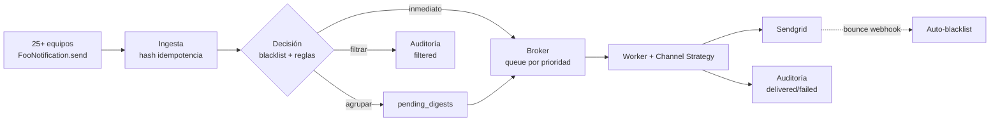

# Mission — Central de Notificaciones

**Estado**: Draft v1 · **Fecha**: 2026-05-10 · **Owner**: Sebastián Machuca

## 1. Overview & Motivación

Más de 25 equipos de la empresa envían notificaciones a usuarios sin coordinación: un mismo usuario recibe el mismo día emails de cumpleaños, recordatorios, encuestas, push y SMS, todos desde implementaciones independientes. Esto produce cuatro problemas reales:

1. **Spam y fatiga comunicacional** — el usuario se desconecta del canal porque todo le llega al mismo tiempo.
2. **Inconsistencia de canales** — la misma notificación puede llegar por SMS para un equipo y por email para otro; activar/desactivar un canal exige coordinar 25+ deploys.
3. **Costo de integración alto** — crear una notificación nueva implica tocar varios archivos con nombres que deben coincidir; un typo cuesta horas de debugging.
4. **Sin auditoría** — responder "¿por qué Juan no recibió el email?" es un proceso manual que toma horas o es directamente imposible.

La **Central de Notificaciones** es el producto interno de plataforma que resuelve esto siendo el único punto de entrada para todas las comunicaciones salientes a usuarios.

## 2. Visión del producto

> Un equipo define una notificación en un archivo. La plataforma decide cómo, cuándo y por dónde se entrega, respeta los opt-outs del usuario, evita spam, y deja registro de todo.

Tres garantías que ofrecemos:

- **Una sola forma de definir y enviar** — un archivo, una línea para enviar (`FooNotification.send(destinatario)`).
- **Una sola fuente de verdad sobre las reglas** — qué canales, con qué frecuencia, agrupado o no, configurable desde una UI sin redeploy.
- **Una sola fuente de verdad sobre el historial** — quién recibió qué, cuándo, por qué canal, y si fue filtrado, por qué motivo.

## 3. Audiencias y valor entregado

| Audiencia | Lo que obtiene |
| :---- | :---- |
| Equipos de ingeniería (25+) | API simple para integrar nuevas notificaciones en < 1 hora. No tocan código de envío, ni retry, ni eligen proveedor. |
| Stakeholders autorizados | Control de canales, frecuencia y agrupación desde UI, sin pedir un deploy. |
| Soporte / Customer Success | Responden "¿por qué Juan no recibió X?" en segundos con timeline completo. |
| Compliance / Legal | Auditoría inmutable y gestión transparente de opt-outs y blacklists. |
| DevOps / SRE | Punto único para optimizar costos, monitorear salud y responder incidentes. |

## 4. Workflow central

Cada transición (`received → validated → enqueued → dispatched → delivered/failed/filtered`) se persiste en `notification_audit` con un `correlation_id` único que cruza logs internos y los del proveedor.

## 5. Alcance (MVP) y fuera de alcance

### Dentro del alcance (Parte 1 + Parte 2 del enunciado)

- API `AbstractNotification` con `title`, `body`, `send(recipient)`.
- Email vía Sendgrid como único canal activo, con adapter intercambiable.
- Idempotencia determinista (hash SHA256 + UNIQUE constraint en Postgres).
- Broker de colas en Postgres con `SKIP LOCKED`, particionado por prioridad.
- Motor de reglas configurable desde UI (frecuencia, canales, agrupación).
- Blacklist (global / por tipo / por canal) con tres fuentes: opt-out manual, hard bounce vía webhook, admin UI.
- Auditoría inmutable (JSONB + GIN, particionado diario).
- UI Admin (Hotwire): Dashboard, Reglas, Auditoría, Blacklist, Templates, DLQ.

### Fuera del alcance (Roadmap evolutivo)

- Migración a Kafka/SQS/RabbitMQ.
- Extracción a microservicio dedicado.
- Rate limiter proactivo coordinado entre workers.
- Soporte de zonas horarias múltiples (idempotencia ya en UTC pero presentación TZ-aware queda pendiente).
- Canales adicionales (SMS, Push, WhatsApp, Slack) — la arquitectura los soporta vía Strategy pero no los implementamos en este alcance.

## 6. Métricas de éxito (SLOs)

| Métrica | Objetivo | Cómo se mide |
| :---- | :---- | :---- |
| Latencia de ingesta (p95) | < 50 ms | APM (New Relic / equivalente) |
| Throughput sostenido | 140 rps (≈ 500.000/h) sin degradación | APM + CloudWatch |
| Duplicados entregados | 0% | Conteo de filas con mismo `idempotency_hash` que fueron despachadas > 1 vez |
| Errores críticos | < 0.1% | Sentry + tabla `notification_audit` con `status=failed` |
| Tiempo de integración (DevEx) | < 1 hora para un nuevo tipo de notificación | Auto-reporte de equipos integradores |
| Aplicación de cambios de regla | ≤ 5 min (TTL del cache) | Cache TTL configurado en Rails.cache |

## 7. Restricciones y supuestos

- Se ejecuta como módulo dentro del monolito Rails existente (sin infra nueva).
- Stack base disponible: cluster EC2 + RDS PostgreSQL + Sendgrid contratado.
- SSO y framework de back-office del monolito son reutilizables para la UI Admin.
- El método podría ser invocado hasta **500.000 veces por hora** (≈ 140 rps).
- Para el ejercicio técnico, no buscamos cobertura de producción ni deploy automático; sí queremos demostrar capacidad de razonamiento, diseño y comunicación.
